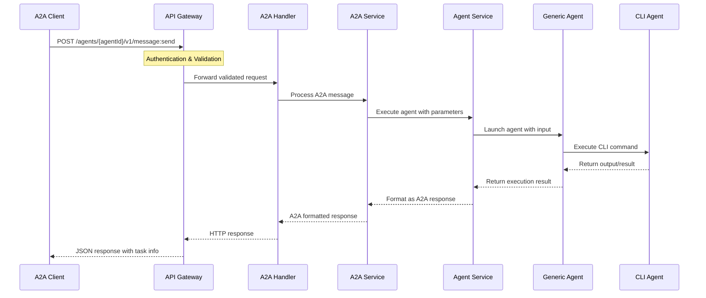
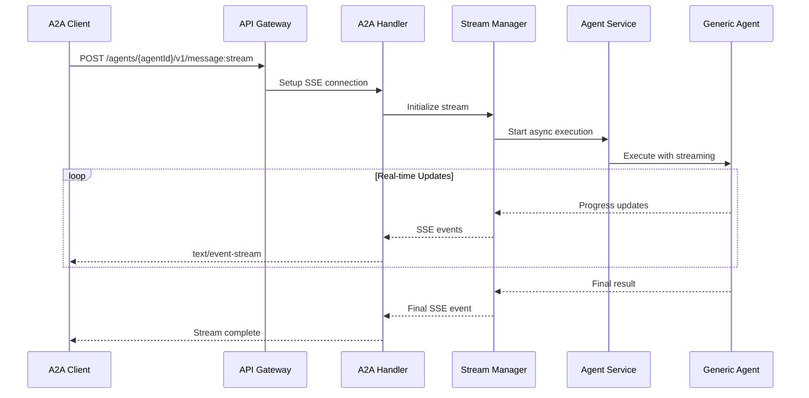
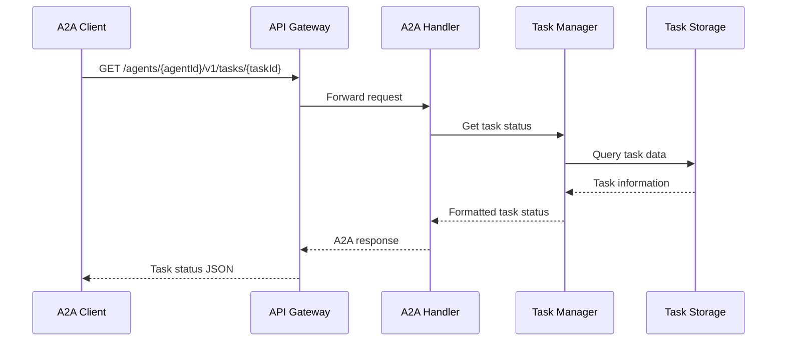
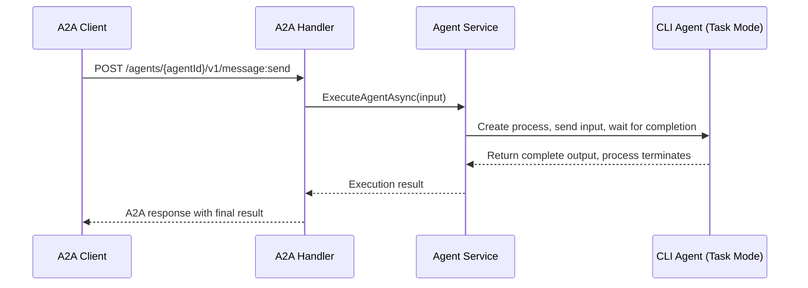
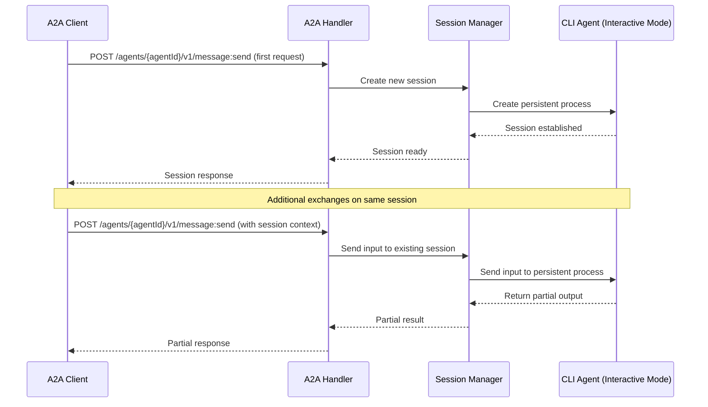

# A2A Endpoints Implementation Flow

**Document Type**: Technical Implementation Guide
**Created**: 2025-11-18
**Purpose**: Detailed flow documentation for A2A endpoint implementation with diagrams and code examples

## Overview

This document provides comprehensive implementation details for the A2A (Agent-to-Agent) protocol endpoints, including request flow diagrams, code structure, and integration patterns with the AI Agent Wrapper system.

## 🏗️ Architecture Overview

### System Components

```
┌─────────────────────────────────────────────────────────────────┐
│                        A2A Client (External)                    │
└─────────────────────┬───────────────────────────────────────────┘
                      │ HTTP/HTTPS
                      ▼
┌─────────────────────────────────────────────────────────────────┐
│                    API Gateway Layer                           │
│  ┌─────────────┐  ┌─────────────┐  ┌─────────────┐            │
│  │   Router    │  │ Middleware  │  │  Validator  │            │
│  │  (Gin)      │  │  (Auth)     │  │ (Request)   │            │
│  └──────┬──────┘  └──────┬──────┘  └──────┬──────┘            │
│         │               │               │                      │
│         └───────┬───────┴───────┬───────┘                      │
│                 │               │                              │
└─────────────────┼───────────────┼──────────────────────────────┘
                  │               ▼
                  │    ┌──────────────────────┐
                  │    │   A2A Handler        │
                  │    │  (Protocol Layer)    │
                  │    └──────────┬───────────┘
                  │               │
                  ▼               ▼
┌─────────────────────────────────────────────────────────────────┐
│                    Service Layer                               │
│  ┌─────────────┐  ┌─────────────┐  ┌─────────────┐            │
│  │A2A Service  │  │Agent Service│  │   Scheduler │            │
│  │ (Protocol)  │  │(Execution)  │  │  Service    │            │
│  └──────┬──────┘  └──────┬──────┘  └──────┬──────┘            │
│         │               │               │                      │
└─────────┼───────────────┼───────────────┼──────────────────────┘
          │               │               │
          ▼               ▼               ▼
┌─────────────────────────────────────────────────────────────────┐
│                  Agent Execution Layer                         │
│  ┌─────────────┐  ┌─────────────┐  ┌─────────────┐            │
│  │Generic Agent│  │Process Mgmt │  │I/O Patterns │            │
│  │  Adapter    │  │ (Pool/Limit)│  │ (Stdin/File)│            │
│  └──────┬──────┘  └──────┬──────┘  └──────┬──────┘            │
│         │               │               │                      │
└─────────┼───────────────┼───────────────┼──────────────────────┘
          │               │               │
          ▼               ▼               ▼
┌─────────────────────────────────────────────────────────────────┐
│                      CLI AI Agents                             │
│                    (Claude, Codex, etc.)                       │
└─────────────────────────────────────────────────────────────────┘
```

## 🔀 A2A Endpoint Request Flow

### Basic Message Send Flow



### Streaming Message Flow



### Task Management Flow



## 📝 Core A2A Endpoints Implementation

### 1. Message Send Endpoint (`POST /agents/{agentId}/v1/message:send`)

**Request Flow:**
```go
// Handler implementation
func (h *A2AHandler) HandleMessageSend(c *gin.Context) {
    agentID := c.Param("agentId")

    // 1. Parse A2A request
    var request A2AMessageSendRequest
    if err := c.ShouldBindJSON(&request); err != nil {
        c.JSON(400, A2AErrorResponse{
            Error: A2AError{
                Code:    -32602,
                Message: "Invalid params",
                Data:    err.Error(),
            },
        })
        return
    }

    // 2. Validate A2A protocol compliance
    if err := h.validateA2ARequest(&request); err != nil {
        c.JSON(400, A2AErrorResponse{Error: *err})
        return
    }

    // 3. Convert A2A message to agent input
    agentInput, err := h.convertA2AToAgentInput(request)
    if err != nil {
        c.JSON(500, A2AErrorResponse{
            Error: A2AError{
                Code:    -32603,
                Message: "Internal error",
                Data:    err.Error(),
            },
        })
        return
    }

    // 4. Execute agent asynchronously
    taskID := h.generateTaskID()
    result, err := h.agentService.ExecuteAgentAsync(agentID, agentInput, taskID)
    if err != nil {
        c.JSON(500, A2AErrorResponse{
            Error: A2AError{
                Code:    -32001,
                Message: "Agent execution failed",
                Data:    err.Error(),
            },
        })
        return
    }

    // 5. Convert result to A2A response format
    response := h.convertAgentResultToA2A(result, request.ID)

    // 6. Return A2A compliant response
    c.JSON(200, response)
}
```

**Request/Response Examples:**

```json
// A2A Message Send Request
{
  "jsonrpc": "2.0",
  "id": "msg-123",
  "method": "message/send",
  "params": {
    "message": {
      "role": "user",
      "content": "Analyze this code and suggest improvements",
      "metadata": {
        "code": "function example() { return 'hello'; }"
      }
    },
    "configuration": {
      "acceptedOutputModes": ["text", "json"],
      "historyLength": 10,
      "blocking": false
    }
  }
}

// A2A Message Send Response
{
  "jsonrpc": "2.0",
  "id": "msg-123",
  "result": {
    "task": {
      "id": "task-456",
      "status": "running",
      "createdAt": "2025-11-18T10:30:00Z",
      "updatedAt": "2025-11-18T10:30:00Z"
    }
  }
}
```

### 2. Task Status Endpoint (`GET /agents/{agentId}/v1/tasks/{taskId}`)

**Implementation:**
```go
func (h *A2AHandler) HandleTaskGet(c *gin.Context) {
    agentID := c.Param("agentId")
    taskID := c.Param("taskId")

    // 1. Retrieve task from storage
    task, err := h.taskManager.GetTask(agentID, taskID)
    if err != nil {
        c.JSON(404, A2AErrorResponse{
            Error: A2AError{
                Code:    -32001,
                Message: "Task not found",
                Data:    err.Error(),
            },
        })
        return
    }

    // 2. Convert to A2A task format
    a2aTask := h.convertTaskToA2AFormat(task)

    // 3. Return A2A compliant response
    c.JSON(200, A2ATaskResponse{
        Task: a2aTask,
    })
}
```

### 3. Streaming Endpoint (`POST /agents/{agentId}/v1/message:stream`)

**Implementation with Server-Sent Events:**
```go
func (h *A2AHandler) HandleMessageStream(c *gin.Context) {
    agentID := c.Param("agentId")

    // 1. Parse request
    var request A2AStreamRequest
    if err := c.ShouldBindJSON(&request); err != nil {
        c.JSON(400, A2AErrorResponse{Error: *err})
        return
    }

    // 2. Set up SSE headers
    c.Header("Content-Type", "text/event-stream")
    c.Header("Cache-Control", "no-cache")
    c.Header("Connection", "keep-alive")

    // 3. Create stream context
    ctx, cancel := context.WithCancel(c.Request.Context())
    defer cancel()

    // 4. Start streaming execution
    stream := h.streamManager.CreateStream(agentID, request)

    // 5. Stream events to client
    for {
        select {
        case event := <-stream.Events():
            // Format as SSE event
            sseEvent := h.formatSSEEvent(event)
            c.SSEvent("message", sseEvent)
            c.Writer.Flush()

            if event.Final {
                return
            }

        case <-ctx.Done():
            return

        case <-time.After(30 * time.Second):
            // Send keep-alive
            c.SSEvent("ping", "{}")
            c.Writer.Flush()
        }
    }
}
```

## 🔄 Handling Task vs Interactive Modes in A2A Endpoints

The A2A endpoints need to handle both task and interactive modes differently. The mode is determined from the agent configuration and affects how requests are processed.

### Task Mode Handling

In task mode, each A2A request triggers a single execution that completes and terminates:



### Interactive Mode Handling

In interactive mode, A2A requests maintain a session that can handle multiple exchanges:



### Mode Detection and Routing

```go
func (h *A2AHandler) HandleMessageSend(c *gin.Context) {
    agentID := c.Param("agentId")

    // Get agent configuration to determine mode
    agentConfig, err := h.agentService.GetAgentConfig(agentID)
    if err != nil {
        c.JSON(404, A2AErrorResponse{
            Error: A2AError{
                Code:    -32001,
                Message: "Agent not found",
            },
        })
        return
    }

    var request A2AMessageSendRequest
    if err := c.ShouldBindJSON(&request); err != nil {
        c.JSON(400, A2AErrorResponse{Error: *err})
        return
    }

    var response interface{}

    switch agentConfig.Mode {
    case "task":
        response, err = h.handleTaskMode(agentID, request)
    case "interactive":
        response, err = h.handleInteractiveMode(agentID, request)
    default:
        c.JSON(500, A2AErrorResponse{
            Error: A2AError{
                Code:    -32603,
                Message: "Unknown agent mode",
            },
        })
        return
    }

    if err != nil {
        c.JSON(500, A2AErrorResponse{
            Error: A2AError{
                Code:    -32002,
                Message: "Execution failed",
                Data:    err.Error(),
            },
        })
        return
    }

    c.JSON(200, response)
}

func (h *A2AHandler) handleTaskMode(agentID string, request A2AMessageSendRequest) (interface{}, error) {
    agentInput, err := h.convertA2AToAgentInput(request)
    if err != nil {
        return nil, err
    }

    taskID := h.generateTaskID()
    result, err := h.agentService.ExecuteAgentAsync(agentID, agentInput, taskID)
    if err != nil {
        return nil, err
    }

    return h.convertAgentResultToA2A(result, request.ID), nil
}

func (h *A2AHandler) handleInteractiveMode(agentID string, request A2AMessageSendRequest) (interface{}, error) {
    // Get or create session for this agent
    session, err := h.sessionManager.GetOrCreateSession(agentID)
    if err != nil {
        return nil, err
    }

    // Convert A2A request to agent input
    agentInput, err := h.convertA2AToAgentInput(request)
    if err != nil {
        return nil, err
    }

    // Send input to the persistent agent process
    response, err := session.SendInput(agentInput)
    if err != nil {
        return nil, err
    }

    // Return response in A2A format
    return A2AMessageSendResponse{
        Result: A2AResult{
            Content: response,
            Format:  "text",
        },
        Task: &A2ATask{
            ID:        session.SessionID,
            Status:    "running", // Session remains active
            CreatedAt: session.StartedAt,
            UpdatedAt: time.Now(),
        },
        ID: request.ID,
    }, nil
}
```

### Session Management for Interactive Mode

For interactive mode, the system implements a session manager:

```go
type InteractiveSession struct {
    SessionID    string
    AgentID      string
    Process      *exec.Cmd
    Stdin        io.WriteCloser
    Stdout       io.ReadCloser
    LastActivity time.Time
    Timeout      time.Duration
    Mutex        sync.RWMutex
}

type SessionManager struct {
    sessions map[string]*InteractiveSession
    mutex    sync.RWMutex
}

func (sm *SessionManager) GetOrCreateSession(agentID string) (*InteractiveSession, error) {
    sm.mutex.Lock()
    defer sm.mutex.Unlock()

    // Check if session already exists for this agent
    for _, session := range sm.sessions {
        if session.AgentID == agentID && !session.isTimedOut() {
            session.LastActivity = time.Now()
            return session, nil
        }
    }

    // Create new session
    session, err := sm.createSession(agentID)
    if err != nil {
        return nil, err
    }

    sm.sessions[session.SessionID] = session
    return session, nil
}

func (is *InteractiveSession) SendInput(input string) (string, error) {
    is.Mutex.Lock()
    defer is.Mutex.Unlock()

    if is.isTimedOut() {
        return "", errors.New("session timed out")
    }

    // Send input to agent
    if _, err := is.Stdin.Write([]byte(input + "\n")); err != nil {
        return "", err
    }

    is.LastActivity = time.Now()

    // Read response from agent
    reader := bufio.NewReader(is.Stdout)
    response, err := reader.ReadString('\n')
    if err != nil {
        return "", err
    }

    return strings.TrimSpace(response), nil
}
```

## 🔧 A2A Protocol Integration

### Protocol Layer Architecture

```go
// A2A Protocol interfaces
package a2a

type IA2AService interface {
    // Core A2A protocol methods
    SendMessage(ctx context.Context, request *MessageSendRequest) (*MessageSendResponse, error)
    StreamMessage(ctx context.Context, request *StreamMessageRequest) (<-chan StreamEvent, error)
    GetTask(ctx context.Context, taskID string) (*Task, error)
    ListTasks(ctx context.Context, params *ListTasksParams) (*ListTasksResponse, error)
    CancelTask(ctx context.Context, taskID string) (*Task, error)
    // Interactive mode specific methods
    OpenSession(ctx context.Context, agentID string) (*Session, error)
    SendMessageToSession(ctx context.Context, sessionID string, request *MessageSendRequest) (*MessageSendResponse, error)
    CloseSession(ctx context.Context, sessionID string) error
}

type MessageSendRequest struct {
    Message       Message                `json:"message"`
    Configuration MessageConfiguration   `json:"configuration,omitempty"`
    Metadata      map[string]interface{} `json:"metadata,omitempty"`
}

type Message struct {
    Role     string                 `json:"role"` // "user", "assistant", "system"
    Content  string                 `json:"content"`
    Metadata map[string]interface{} `json:"metadata,omitempty"`
}
```

### Agent-to-A2A Bridge

```go
// Bridge between generic agents and A2A protocol
package services

type A2AAgentBridge struct {
    agentService IAgentService
    taskManager  ITaskManager
}

func (b *A2AAgentBridge) ConvertA2AToAgentInput(a2aRequest *a2a.MessageSendRequest) (string, error) {
    // Extract content from A2A message
    switch a2aRequest.Message.Role {
    case "user":
        return b.extractUserInput(a2aRequest.Message)
    case "assistant":
        return b.extractAssistantInput(a2aRequest.Message)
    default:
        return "", fmt.Errorf("unsupported message role: %s", a2aRequest.Message.Role)
    }
}

func (b *A2AAgentBridge) ConvertAgentResultToA2A(result *ExecutionResult, requestID string) *a2a.MessageSendResponse {
    return &a2a.MessageSendResponse{
        Task: &a2a.Task{
            ID:        result.TaskID,
            Status:    b.mapExecutionStatusToA2A(result.Status),
            CreatedAt: result.StartTime,
            UpdatedAt: result.EndTime,
            Result: &a2a.TaskResult{
                Content: result.Output,
                Format:  "text",
            },
        },
        ID: requestID,
    }
}
```

## 🛡️ Error Handling Flow

### A2A Error Response Mapping

```go
func (h *A2AHandler) handleError(c *gin.Context, err error, requestID string) {
    var a2aErr *a2a.A2AError

    switch {
    case errors.Is(err, ErrAgentNotFound):
        a2aErr = &a2a.A2AError{
            Code:    -32001,
            Message: "Agent not found",
            Data:    map[string]string{"agentId": c.Param("agentId")},
        }
    case errors.Is(err, ErrTaskNotFound):
        a2aErr = &a2a.A2AError{
            Code:    -32001,
            Message: "Task not found",
            Data:    map[string]string{"taskId": c.Param("taskId")},
        }
    case errors.Is(err, ErrAgentBusy):
        a2aErr = &a2a.A2AError{
            Code:    -32005,
            Message: "Agent busy",
            Data:    map[string]string{"retryAfter": "30"},
        }
    default:
        a2aErr = &a2a.A2AError{
            Code:    -32603,
            Message: "Internal error",
            Data:    err.Error(),
        }
    }

    c.JSON(h.getHTTPStatusForA2AError(a2aErr.Code), a2a.ErrorResponse{
        Error:     *a2aErr,
        ID:        requestID,
        JSONRPC:   "2.0",
    })
}
```

## 📊 Request Processing Pipeline

### Middleware Chain

```go
func setupA2ARoutes(router *gin.Engine, handler *A2AHandler) {
    a2a := router.Group("/agents/:agentId/v1")
    {
        // Apply middleware chain
        a2a.Use(
            RequestIDMiddleware(),          // Generate request ID
            AuthenticationMiddleware(),     // Validate auth token
            RateLimitMiddleware(),         // Rate limiting (currently unlimited per spec)
            LoggingMiddleware(),           // Request/response logging
            ValidationMiddleware(),        // A2A protocol validation
        )

        // A2A endpoints
        a2a.POST("/message:send", handler.HandleMessageSend)
        a2a.POST("/message:stream", handler.HandleMessageStream)
        a2a.GET("/tasks", handler.HandleTaskList)
        a2a.GET("/tasks/:taskId", handler.HandleTaskGet)
        a2a.POST("/tasks/:taskId:cancel", handler.HandleTaskCancel)

        // Agent discovery
        a2a.GET("/.well-known/agent-card.json", handler.HandleAgentCard)
    }
}
```

## 🔍 Integration Points

### 1. Agent Service Integration

```go
// Agent service interface for A2A integration
type IAgentService interface {
    // Execute agent and return result
    ExecuteAgent(agentID string, input string) (*ExecutionResult, error)

    // Execute agent asynchronously for streaming
    ExecuteAgentAsync(agentID string, input string, taskID string) (*Task, error)

    // Get agent status
    GetAgentStatus(agentID string) (*AgentStatus, error)

    // List available agents
    ListAgents() ([]*AgentConfiguration, error)
}
```

### 2. Task Management Integration

```go
// Task manager for A2A task operations
type ITaskManager interface {
    CreateTask(agentID string, input string) (*Task, error)
    GetTask(agentID string, taskID string) (*Task, error)
    ListTasks(agentID string, params *ListTasksParams) ([]*Task, error)
    CancelTask(agentID string, taskID string) error
    UpdateTaskStatus(taskID string, status TaskStatus) error
}
```

## 🚀 Performance Considerations

### 1. Async Processing
```go
// Async execution for non-blocking A2A responses
func (s *A2AService) executeAsync(agentID string, input string) <-chan *ExecutionResult {
    resultChan := make(chan *ExecutionResult, 1)

    go func() {
        result, err := s.agentService.ExecuteAgent(agentID, input)
        if err != nil {
            result = &ExecutionResult{
                Status: "failed",
                Error:  err.Error(),
            }
        }
        resultChan <- result
        close(resultChan)
    }()

    return resultChan
}
```

### 2. Connection Pooling
```go
// HTTP client pool for A2A requests
var httpClientPool = sync.Pool{
    New: func() interface{} {
        return &http.Client{
            Timeout: 30 * time.Second,
            Transport: &http.Transport{
                MaxIdleConns:        100,
                MaxIdleConnsPerHost: 10,
                IdleConnTimeout:     90 * time.Second,
            },
        }
    },
}
```

## ✅ Testing Strategy

### A2A Endpoint Testing
```go
func TestA2AMessageSend(t *testing.T) {
    // Setup test server
    router := setupTestRouter()

    // Create test request
    request := A2AMessageSendRequest{
        Message: Message{
            Role:    "user",
            Content: "test input",
        },
    }

    // Make request
    w := httptest.NewRecorder()
    body, _ := json.Marshal(request)
    req, _ := http.NewRequest("POST", "/agents/test-agent/v1/message:send", bytes.NewBuffer(body))
    req.Header.Set("Content-Type", "application/json")
    req.Header.Set("Authorization", "Bearer test-token")

    router.ServeHTTP(w, req)

    // Assertions
    assert.Equal(t, http.StatusOK, w.Code)
    var response A2AMessageSendResponse
    err := json.Unmarshal(w.Body.Bytes(), &response)
    assert.NoError(t, err)
    assert.NotEmpty(t, response.Task.ID)
    assert.Equal(t, "running", response.Task.Status)
}
```

## 📋 Implementation Checklist

- [ ] **Core A2A Handler Implementation**
  - [ ] Message send endpoint
  - [ ] Message stream endpoint
  - [ ] Task management endpoints
  - [ ] Error handling and mapping

- [ ] **Protocol Integration**
  - [ ] A2A request/response types
  - [ ] Protocol validation
  - [ ] Agent-to-A2A bridge
  - [ ] Streaming support

- [ ] **Middleware Chain**
  - [ ] Authentication middleware
  - [ ] Request validation
  - [ ] Error handling middleware
  - [ ] Logging middleware

- [ ] **Testing**
  - [ ] Unit tests for handlers
  - [ ] Integration tests with mock agents
  - [ ] A2A protocol compliance tests
  - [ ] Performance tests

## 🔄 Next Steps

1. **Implement Core Handlers**: Start with basic message send functionality
2. **Add Protocol Validation**: Ensure A2A specification compliance
3. **Integrate Agent Services**: Connect to existing agent execution layer
4. **Add Streaming Support**: Implement Server-Sent Events for real-time updates
5. **Comprehensive Testing**: Validate all endpoints and error scenarios
6. **Performance Optimization**: Add async processing and connection pooling

This implementation flow ensures that the A2A endpoints properly integrate with the existing AI Agent Wrapper architecture while maintaining full protocol compliance and performance requirements.